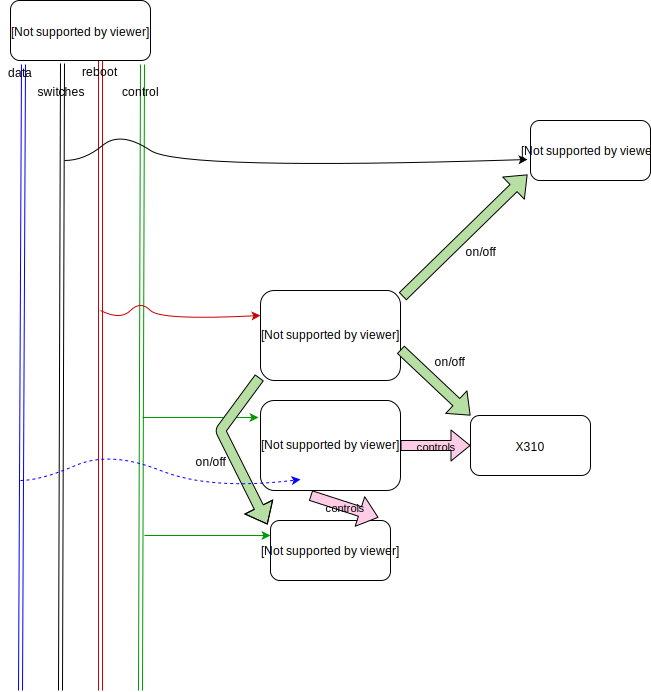

# SDR nodes accessible through `fit51`

## overview

* two SDR nodes are attached to fit51, one USRP X310 and one USRP N320.
* each USRP board is connected to fit51 through 2 SFP+ links at 10Gbps.



* this node is not one of the standard 37 nodes displayed on the web UI on r2lab.inria.fr
* there is currently no easy means to reinstall the node from a (rhubarbe) image.

## power management

please remember to ***SWITCH OFF EVERYTHING BEHIND YOU***  
that means
* the 2 USRP nodes
* as well as the `fit51` node itself

### power management (fit51 node)

| action | command |
|--------|----------|
| turn on | `on-51` |
| turn off | `off-51` |
| reset | `reset-51` |
| status | `status-51` |

### power management (USRP nodes)

both USRP nodes (as well as macphone1 btw) are controlled through a separate old-school PCU
(power-control-unit) Black Box Power Switch 


```console
# make sure to connect to faraday with a `ssh -Y`
firefox http://192.168.1.50 
```

login with `admin` / `adminet++`

**CAUTION:** To switch off the N320 node, run first `ssh root@sdr51 shutdown now`. 

## login

### log into the N320 node

```
sliceX@faraday $ ssh root@sdr51
```

the prompt for that session is `root@ni-n3xx-31B3A77`

### log into the Dell server fit51

At this point in time (2020 June), we have no tool for burning the OS image on this box;
so here's the usage model instead :

* regular user slices on faraday have open access to fit51
* ***BUT*** only as the `r2lab` user - not `root`
* the `r2lab` user on fit51 in turn has `sudo` open access to the `docker` - and `podman` - commands
* the podman engine has been configured to expose the host's network to its containers

This way a regular R2lab user has the means to build and run any image on that box

We expose these 2 images as a basis; 

| distro | image name |
|--------|------------|
| Fedora 32 | `fedora32-r2lab` |
| Ubuntu 18 | `ubuntu18-r2lab` |

Ideally we would have preferred a scheme where the box exposes several non-root logins, each corresponding to a container image, but that's cumbersome to build, and less flexible, so let's see where this usage model brings us.

****

So a typical session would do something like (note that in the following, `docker` may be
used instead of `podman`)

* log into fit51, from faraday (of course) :  
  ```console
  sliceX@faraday $ ssh r2lab@fit51
  ```
* inspect the available images; to filter on locally customized ones, do :  
  ```console
  root@fit51 ~ # sudo podman images | grep r2lab
  localhost/ubuntu18-r2lab            latest   cab901434400   7 minutes ago    97.1 MB
  localhost/fedora32-r2lab            latest   d7a3f0da1ff6   32 minutes ago   423 MB
  ```
* enter a container :  
  ```
  [r2lab@fit51 ~]$ sudo podman run -ti --rm fedora32-r2lab
  ```
* you have full access to the native host network and interfaces  
  ```
  [root@fit51 /]# ping -c 1 8.8.8.8
  <snip>
  64 bytes from 8.8.8.8: icmp_seq=1 ttl=117 time=3.76 ms
  <snip>
  ```
* beware that on quit, you lose everything if you use the `--rm` option as recommended
  above  
  however if you do not use the `--rm` flag, then it is expected that you clean up behind
  yourself :-)

****

## host software configuration for fit51

* fedora-32
* podman 1.9.3 + podman-docker (use the `docker` command as usual)
* bulk of the available disk space in `/containers`

## USRP X310

The two network interfaces on fit51 are up by default:

`x310-sfp0` and `x310-sfp1`, both configured with MTU=9000.

To switch on/off the X310 node, you need to use the Black Box Power switch - see above

## USRP N320

The two network interfaces on fit51 are up by default:

`n320-sfp0` and `n320-sfp1`, both configured with MTU=8000.

Another 1Gbps interface is available on the USRP N320 for management. It is known **from
`faraday`** as `sdr51`, connected to the *control* subnet, available from faraday through
`ssh root@sdr51`.

To switch on the X310 node, you need to use the Black Box Power switch - see above

**CAUTION:** To switch off the N320 node, run first `ssh root@sdr51 shutdown now`. 

****
## Configurations
****


### Configurations made on fit51

* all 4 interfaces are 10Gbps SFP+ 


#### /etc/sysconfig/network-scripts/ifcfg-x310-sfp0
```
NAME=x310-sfp0
DEVICE=x310-sfp0
HWADDR=00:0e:1e:79:d7:90
TYPE=Ethernet
ONBOOT=yes
BOOTPROTO=static
IPADDR=10.51.100.1
PREFIX=24
MTU=9000
```
#### /etc/sysconfig/network-scripts/ifcfg-x310-sfp1
```
NAME=x310-sfp1
DEVICE=x310-sfp1
HWADDR=00:0e:1e:79:d7:92
TYPE=Ethernet
ONBOOT=yes
BOOTPROTO=static
IPADDR=10.51.101.1
PREFIX=24
MTU=9000
```
#### /etc/sysconfig/network-scripts/ifcfg-n320-sfp0
```
NAME=n320-sfp0
DEVICE=n320-sfp0
HWADDR=f8:f2:1e:82:d7:c0
TYPE=Ethernet
ONBOOT=yes
BOOTPROTO=static
IPADDR=10.51.200.1
PREFIX=24
MTU=8000
```
#### /etc/sysconfig/network-scripts/ifcfg-n320-sfp1
```
NAME=n320-sfp1
DEVICE=n320-sfp1
HWADDR=f8:f2:1e:82:d7:c1
TYPE=Ethernet
ONBOOT=yes
BOOTPROTO=static
IPADDR=10.51.201.1
PREFIX=24
MTU=8000
```
#### /etc/sysctl.conf
```
net.core.rmem_max=62500000
net.core.wmem_max=62500000
```

### Configurations made on the X310 node

See [https://files.ettus.com/manual/page_usrp_x3x0.html](https://files.ettus.com/manual/page_usrp_x3x0.html)

```
root@fit51 ~ # 

uhd_image_loader --args="type=x300,addr=192.168.10.2,fpga=XG"

/usr/libexec/uhd/usrp_burn_mb_eeprom --values="ip-addr2=10.51.100.2"

/usr/libexec/uhd/usrp_burn_mb_eeprom --values="ip-addr3=10.51.101.2"
```


### Configurations made on the N320 node
See [https://kb.ettus.com/USRP_N300/N310/N320/N321_Getting_Started_Guide](https://kb.ettus.com/USRP_N300/N310/N320/N321_Getting_Started_Guide) 

`root@ni-n3xx-31B3A77:~# uhd_image_loader --args "type=n3xx,fpga=XG"`

#### /etc/systemd/network/sfp0.network


```
    sfp0 (static):
    
  	  [Match]
  	   Name=sfp0
	
  	  [Network]
 	   Address=10.51.200.2/24

 	   [Link]
  	  MTUBytes=8000
```
#### /etc/systemd/network/sfp1.network

```
    sfp1 (static):
    
  	  [Match]
  	   Name=sfp1
	
  	  [Network]
 	   Address=10.51.201.2/24

 	  [Link]
  	   MTUBytes=8000
```
